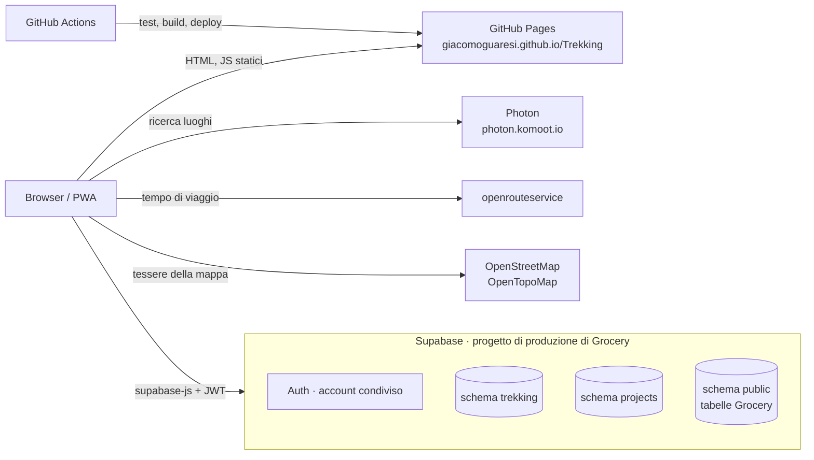

# 03 · Architettura

## Schema generale



## Come funziona

1. **GitHub Pages** serve solo file statici.
2. L'app gira interamente nel browser e usa `@supabase/supabase-js` per l'accesso ([04](04-sicurezza.md)) e per leggere e scrivere le tabelle ([08](08-modello-dati.md)).
3. Postgres applica i permessi con la **Row Level Security**: senza sessione non si vede nulla, nemmeno la posizione di casa.
4. La **ricerca dei luoghi** chiama **Photon** dal browser, senza chiave. Il codice passa da un'interfaccia (`src/dati/luoghi.ts`), così Google Places si potrà aggiungere come seconda implementazione.
5. Il **tempo di viaggio** si chiede a **openrouteservice** (API Directions, profilo `driving-car`, da casa al luogo) e si salva sul trekking. Con `radiuses: [-1, -1]` il luogo si aggancia alla strada più vicina a qualunque distanza: senza, i punti a più di 350 m da una strada danno errore. La chiave è pubblica nel bundle ([04](04-sicurezza.md)).
6. La **distanza in linea d'aria** si calcola nel browser con la formula dell'emisenoverso (haversine), dalle coordinate di casa e del luogo. Non si salva.
7. La **mappa** usa **Leaflet** con le tessere di OpenStreetMap e OpenTopoMap, con l'attribuzione visibile come chiedono le loro regole d'uso.
8. Nessun backend e nessuna Edge Function. I tempi di viaggio mancanti li ricalcola il browser, al salvataggio di un trekking o dal popup all'apertura ([02](02-funzionalita.md)), una richiesta alla volta per restare nei limiti di openrouteservice. Le risposte si dividono in due casi:
   - **percorso impossibile**: risposta di errore di openrouteservice sul percorso (punto o percorso non trovato, distanza oltre il limite) → si toglie il luogo dal trekking;
   - **servizio non disponibile**: rete assente, timeout, errori `5xx`, quota esaurita (`429`), chiave non valida → non si tocca nulla e si riprova più tardi.

## Convivenza con Grocery e Projects sullo stesso progetto Supabase

- **Schema Postgres dedicato `trekking`**: nessuna collisione con `public` (Grocery) e `projects`. Va aggiunto agli *Exposed schemas* dell'API. Il client si crea con `db: { schema: 'trekking' }`.
- **Autenticazione condivisa**: stesso utente Auth delle altre due app.
- **Migrazioni**: come Projects, gli script stanno in `supabase/sql/NNN_descrizione.sql`, numerati e applicati a mano (SQL Editor o `psql`). Lo storico migrazioni della CLI resta a Grocery.
- **Keep-alive**: non serve. Grocery usa il progetto ogni settimana.

## Stack

| Livello | Scelta | Note |
|---|---|---|
| Linguaggio | TypeScript | |
| UI | React 19 | |
| Build | Vite, `base: '/Trekking/'` | |
| Routing | hash router | niente problemi con le rotte profonde su GitHub Pages |
| Stile | Tailwind CSS, come Projects | palette blu montagna, vedi [09](09-interfaccia.md) |
| Icone | lucide-react | coerenza visiva con le altre app |
| Markdown | react-markdown | solo la formattazione di base, niente checklist |
| Mappa | Leaflet + react-leaflet | tessere OpenStreetMap e OpenTopoMap |
| Ricerca luoghi | Photon | dietro un'interfaccia sostituibile |
| Tempo di viaggio | openrouteservice (API Directions) | piano gratuito con chiave |
| Dati e accesso | @supabase/supabase-js + @supabase/ssr | sessione nei cookie con percorso `/`, condivisa con le altre app |
| PWA | vite-plugin-pwa | |
| Test | Vitest, sulla logica pura | |
| CI/CD | GitHub Actions | |

## Test

Come nelle altre app, i test coprono la **logica pura**:
- lettura e validazione delle coordinate incollate;
- durata a passi di mezz'ora e formato del tempo di viaggio;
- distanza in linea d'aria;
- filtri, compresi i trekking con dati mancanti e "Mostra completati";
- ordinamento per colonna, con i valori mancanti in fondo;
- scelta dei trekking con il tempo di viaggio da ricalcolare;
- classificazione delle risposte di openrouteservice: percorso impossibile o servizio non disponibile;
- confronto dei nomi per l'avviso dei doppioni (maiuscole, accenti, spazi);
- scelta di quando ricalcolare il tempo di viaggio (luogo cambiato, valore manuale, valore mancante).

## Struttura cartelle

```
Trekking/
├── README.md · Q&A.md · LICENSE
├── docs/
├── index.html · vite.config.ts · package.json
├── public/                # icone PWA
├── src/
│   ├── main.tsx
│   ├── dominio/           # logica pura + test
│   ├── dati/              # client Supabase, Photon, openrouteservice
│   └── ui/                # pagine e componenti
├── scripts/
├── supabase/sql/          # script SQL numerati
└── .github/workflows/     # pubblica.yml
```

## Ambienti

Un solo ambiente, come Projects: sviluppo e produzione usano **il progetto Supabase di produzione di Grocery**. `npm run dev` in locale lavora sui dati veri.
